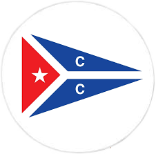

# Tracker de flotte du Yacht Club Classique
<!-- on intègre le logo du YCC -->

  

## Propriétaire

L'intégralité du projet est la propriété du [**Yacht Club Classique**](https://www.yachtclubclassique.com/).
Ce dernier a été développé dans son intégralité par [**Pierre CAU**](
https://www.linkedin.com/in/pierre-cau), étudiant ingénieur à [l'École Centrale de Lyon](https://www.ec-lyon.fr/).
Pour toute question/problème, veuillez vous adresser à l'adresse suivante : [pcaupro@gmail.com](mailto:pcaupro@gmail.com)

## Description

Ce petit projet personnel a pour but de créer un tracker de flotte. Il permettra de suivre les différents mouvements de la flotte du [**Yacht Club Classique**](https://www.yachtclubclassique.com/).   